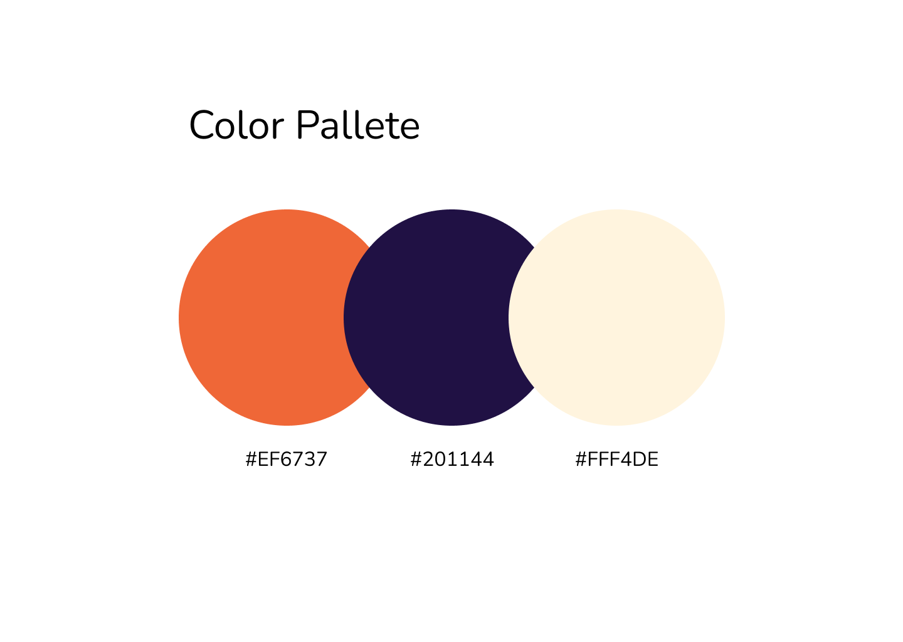

# Hackathon: iNeuron Landing Page

## Coder, Designer
[dhruvil](https://www.findcoder.io/u/dhruvil "findcoder.io/u/dhruvil")

## Live Preview
[https://ineurondhruvil.vercel.app/](https://ineurondhruvil.vercel.app/)

## Video
[https://www.youtube.com/watch?v=YgzzlIywLg4](https://www.youtube.com/watch?v=YgzzlIywLg4)

## Screenshot

## Description

I took inspiration from iNeuron Website, First i examined the iNeuron logo, and found that logo is designed using mainly **2 Colors** one of them is **orange**, and orange color is widely used in Design industry as sign of Honest, Trust, Pure. 

I Selected the color, tweaked it little bit, to get nice color in Figma.

by the way Figma file and Colors are added here, found the link below 👇

[Figma Design File](./ineuron-landing-page.fig)

Then i searched for good fonts, so i went on Google Fonts, found 10 fonts which i found very good, it was tough decision to select one from them, as in Good design, you should not pick more than 2 fonts, it will make any design bad. so i only picked one, which was nicely designed font

Now it was time for designing the web page for iNeuron, in original web page, there are lots of sections available, i rearranged them as per giving good experience to user and for making Impact.

i created this website design by some ideas like minimalism, clean, impactful, easy to find.

As per Technology wise i used HTML, CSS, JavaScript (Little bit).

Used Media Queries 🖼 , so it is now Responsive to Smartphone, Tablet and Desktops. 

The Entire page is **optimized** ⚡️ for **performance**, images are optimized, used SVGs at possible places, The page will load Super fast. I tested the performance Using Google Chrome's **Lighthouse**, and i got the result of 96/100 on Mobile, and again i attempted a Lighthouse Performance Test on Desktop and it gave me 100/100 result. Pretty good isn't it? 😄

Used [SwiperJS](https://swiperjs.com/), to add slider in Team Section. 

## Technology
   

 

## Deployment
